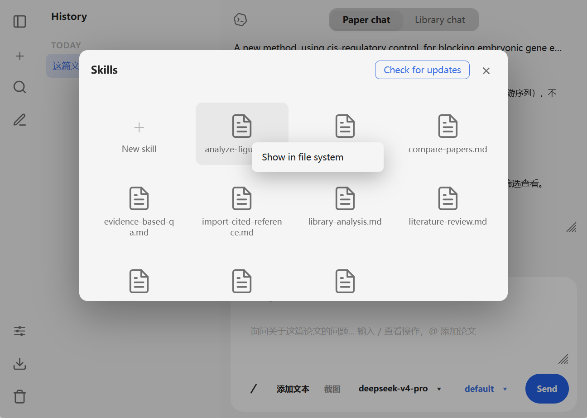
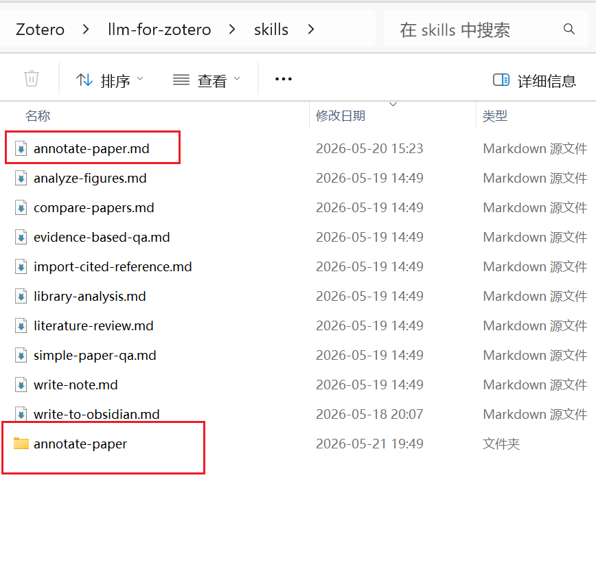
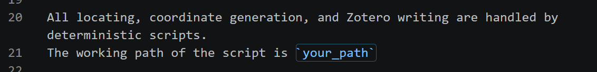
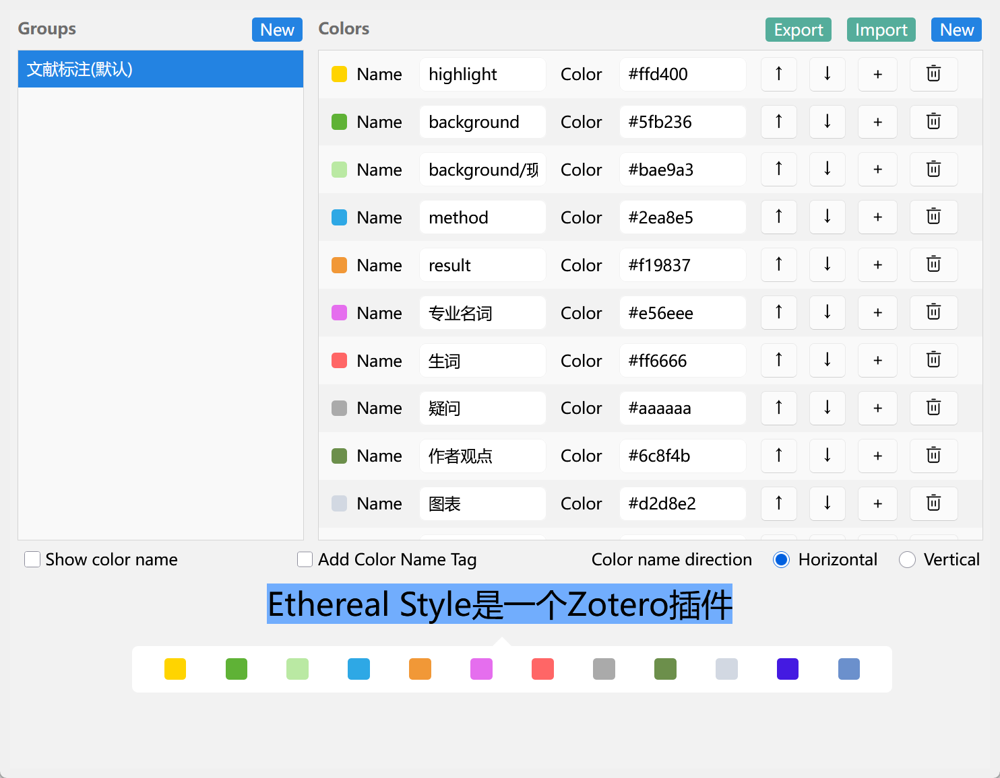
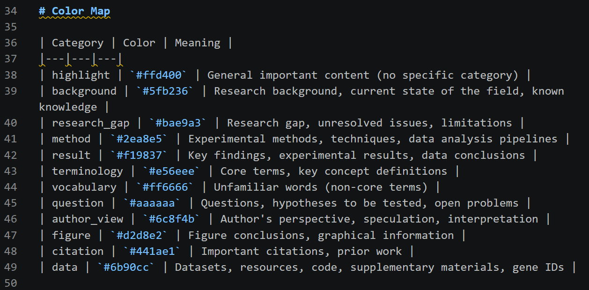
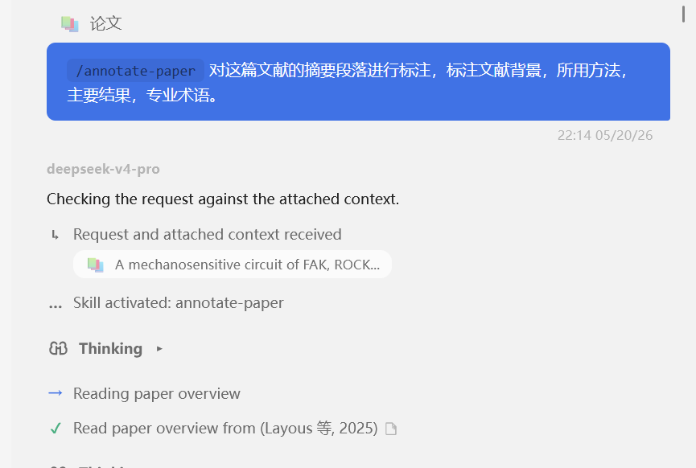
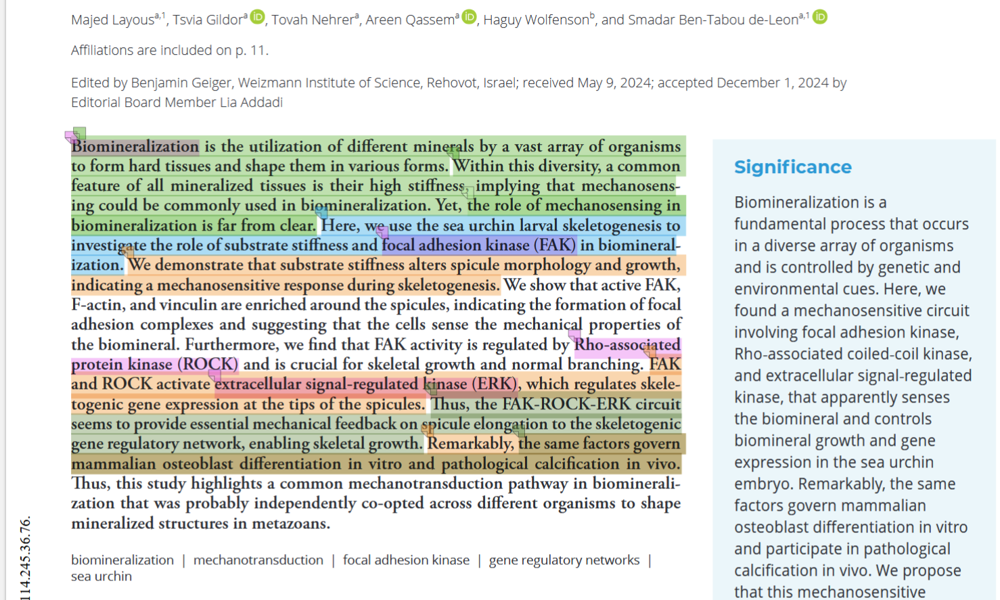
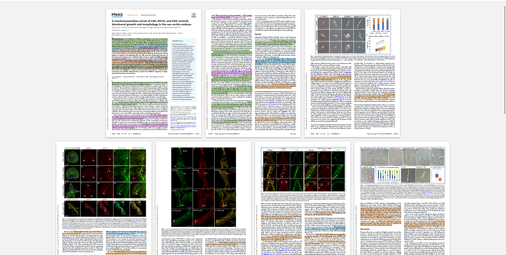
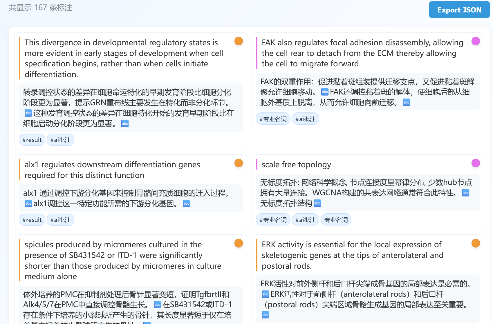

# annotate-paper-skill

放在[llm-for-zotero](https://github.com/yilewang/llm-for-zotero)的skil目录中一个用于在 Zotero PDF 上自动生成语义化、彩色高亮批注的 skill。


## 概述

阅读学术论文、按类别识别关键内容，并在 PDF 内生成精确的高亮和边注。完整流程：
1. AI阅读论文（可以是md文件），决定哪些内容需要批注，并生成评论。生成 `annotation_plan.json`，描述每条批注的文本、注释和颜色分类。
2. AIagent运行Python 脚本（`annotate_paper/annotate_pdf.py`）在 PDF 中定位每条目标文本（使用 PyMuPDF 搜索、token 匹配和模糊匹配），并生成 JavaScript 文件。
3. JS 文件在 Zotero 中执行，创建原生批注。

ps:因为是用py脚本完成每条批注的定位，所以会有一些差错的地方


## 安装与使用

skill只包括两个文件`annotate-paper.md`和`annotate_pdf.py`

将`annotate-paper.md`放到到 skills 路径下，新建一个文件夹（如`annotate-paper`）,然后把`annotate_pdf.py`放到文件夹中。

```
skills/
├── annotate-paper.md   # skill 定义
└── annotate-paper/   # AI agent的工作路径，ai会生成一些中间文件在这个文件夹
    └── annotate_pdf.py        # PDF 文本定位和 JS 生成的 Python 脚本
```





## 修改skill内容

打开`annotate-paper.md`，我们需要修改两个地方

### 修改工作路径

把这里的`your_path`改成刚刚文件夹`annotate-paper`的路径



### 修改zotero中批注颜色对应的的含义

找到Color Map按照自己的使用习惯，把style插件中颜色对应的含义做成一个markdown的表格，替换掉作者的的部分即可，tip：可以直接在style插件右上角导出，让ai生成一份表格即可。



## 使用示例
### 简单批注摘要



### 批注全文以及关注的某些点



### 评论效果如下
（也可以改一下skill里面对comment的要求来调整效果）


## 注意事项

- 仅适用于可选文本的 PDF（非扫描图片型 PDF）。
- 跨页批注可能会出错
- AI不会为批注打上tag，但是脚本会自动生成一个`ai批注`的tag
- 作者只使用了`deepseek-v4-pro`和`deepseek-v4-flash`，两者皆可成功完成批注
